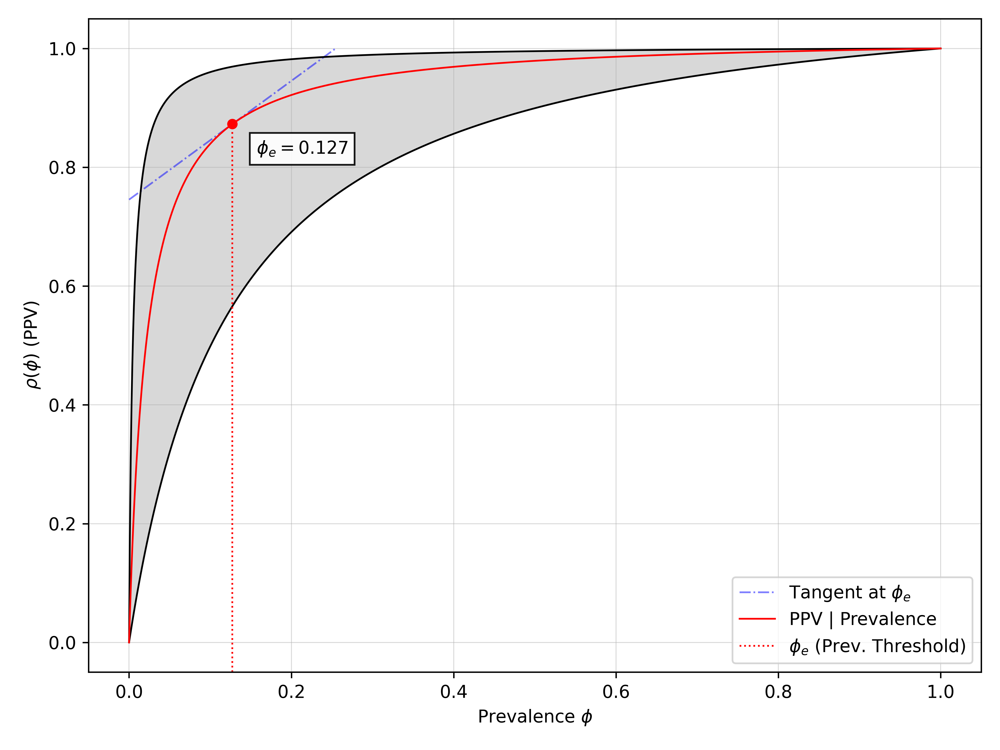

# **Monte Carlo Metrics**

<p align="center">
  <a href="https://github.com/cbsither/mcmetrics">
    
  </a>
</p>

Figure: Example of a screening curve.

Monte Carlo Metrics (MCMetrics) is an easy to use Python library that leverages Bayesian inference to calculate confusion matrix metrics with respect to sample size. MCMetrics is designed to be a simple, yet powerful tool for data scientists, statisticians, and machine learning engineers to calculate metrics like accuracy, recall, precision, and F1 score with credible intervals, and to perform hypothesis testing and model selection. 

## **Table of Contents**

<!--ts-->
* [Overview](#overview)
* [Installation](#installation)
* [Quick Start](#quick-start)
* [Methods and Workflow](#methods-and-workflow)
* [Calculate Metrics](#calculate-metrics)
* [List of Metrics](#list-of-metrics)
<!--te-->

## **Overview**

Monte Carlo Metrics (MCMetrics) offers various functions to calculate confusion matrix methods with respect to sample size. The major advantage of MCMetrics is it reports credible intervals (CIs) for each metric.

MCMetrics calculates CIs by sampling a posterior Dirichlet distribution with a default or specified prior distribution combined with the data. MCMetrics then calculates statistics like accuracy, recall (i.e., sensitivity), positive predictive value (i.e., precision), among others from the samples (see the [List of Metrics] section).

MCMetrics takes a relatively straight forward approach when calculating metric statistics and CIs. First, it samples the upated posterior distribution and generates $n$ total samples. Second, it calculates the metric for each sample. Then third, it summarizes the metrics distribution. Additionally, once a metric is calculated, it is permanently stored and only removed 
if another $n$ samples are called and the ```update``` parameter set to ```False```.

Documentation:
Examples:
Bug Reports: 

## **Installation**

Stable
------
The ```pip``` version is the last stable release. Version: *0.1.1*
```sh
pip install mcmetrics
```

## **Quick Start**

```python
import numpy as np
import mcmetrics

# Create a 3x3 confusion matrix. By default 
# mcmetrics interpets the 'actual' condition 
# as rows and 'predicted' condition as columns.

cm1 = np.array([[100,10],
                [10,100]])

# initiate the Metrics class
mc = MCMetrics(model_name="model_1", cm=cm1) # prior is set to 1 by default

# sample posterior
mc.sample(n=1000) # default n = 100_000

# calculate and return metric and credible intervals

# calculate sensitivity
test1.calculate_metric(metric='sensitivity', averaging=None)
# calculate specificity
test1.calculate_metric(metric='specificity', averaging=None)

# loop calculations
metrics = ['accuracy', 'positive predictive value', 'prevalence threshold']
test1.calculate_metric(metric=metrics, averaging=None)

# {'class_0': {'mu': 0.72, 'cil': 0.56, 'ciu': 0.95},
#  'class_1': {'mu': 0.72, 'cil': 0.56, 'ciu': 0.95},

```


## **Methods and Workflow**

MCMetrics works by automating calling several independent functions in a workflow. As such, MCMetrics 
functions can be called independently and function similar to Scikit-Learn Metrics functions by specifying 
either a confusion matrix or the raw parameter values (i.e., TPs, FPs, FNs, and FPs, or the predicted y and actual y values). A brief example of this workflow and where each function for the [Quick Start](#quick-start) is called is showm below in figure 1:

Once posterior samples are generated, they are stored in a numpy array and used for all subsequent metric
calculations. Additional posterior samples can be added by calling the `sample` method again. Functions 
can also be chained together by specifying 

## **List of Metrics**

A full list of metrics is included below. Each metric is called based by the exact command below in the `metric` parameter. For instance, to call precision, you would call `metric='precision'`. Or for a metric with spaces, you would call `metric='positive predictive value'`.

* `prevalence`

Prevalence is the proportion of positives in a population. These could be the number of people with a disease, the number of people who like a product, etc.

$$
\text{Prevalence} = \frac{TP + FN}{TP + FP + TN + FN}
$$

* `accuracy`

Accuracy is the proportion of true results (both true positives and true negatives) among the total number of cases examined.

$$
\text{Accuracy} = \frac{TP + TN}{TP + FP + TN + FN}
$$

* `balanced accuracy`

$$
\text{Balanced Accuracy} = \frac{1}{2} \left( \frac{TP}{TP + FN} + \frac{TN}{TN + FP} \right)
$$

* `precision`

$$
\text{Precision} = \frac{TP}{TP + FP}
$$

* `positive predictive value`

Same as `precision`.

* `false discovery rate`

$$
\text{False Discovery Rate} = \frac{FP}{FP + TP}
$$

* `f1 score`

$$
\text{F1 Score} = \frac{2 TP}{2 TP + FP + FN}
$$

* `false omission rate`

$$
\text{False Omission Rate} = \frac{FN}{FN + TN}
$$

* `negative predictive value`

$$
\text{Negative Predictive Value} = \frac{TN}{TN + FN}
$$

* `fowlkes-mallows index`

$$
\text{Fowlkes-Mallows Index} = \frac{TP}{\sqrt{(TP + FP)(TP + FN)}}
$$

* `informedness`

$$
\text{Informedness} = \frac{TP}{TP + FN} + \frac{TN}{TN + FP} - 1
$$

* `sensitivity`

$$
\text{Sensitivity} = \frac{TP}{TP + FN}
$$

* `true positive rate`

Same as `sensitivity`.

* `recall`

Same as `sensitivity`.

* `false positive rate`

$$
\text{False Positive Rate} = \frac{FP}{FP + TN}
$$

* `positive likelihood ratio`

$$
\text{Positive Likelihood Ratio} = \frac{\text{Sensitivity}}{1 - \text{Specificity}} = \frac{TP \times (FP + TN)}{FP \times (TP + FN)}
$$

* `markedness`

$$
\text{Markedness} = \frac{TP}{TP + FP} + \frac{TN}{TN + FN} - 1
$$

* `true negative rate`

$$
\text{True Negative Rate} = \frac{TN}{TN + FP}
$$

* `matthews correlation coefficient`

$$
\text{Matthews Correlation Coefficient} = \frac{TP \times TN - FP \times FN}{\sqrt{(TP + FP)(TP + FN)(TN + FP)(TN + FN)}}
$$

* `prevalence threshold`


$$
\text{Prevalence Threshold} = \frac{\sqrt{\text{Sensitivity} \times (1 - \text{Specificity})} \+\ \text{Specificity} \-\ 1}
{\text{Sensitivity} + \text{Specificity} - 1} \=\ \frac{\sqrt{\frac{TP}{TP + FN}\\bigl(1 - \frac{TN}{TN + FP}\bigr)} \+\ \frac{TN}{TN + FP} \-\ 1}
{\Bigl(\frac{TP}{TP + FN} + \frac{TN}{TN + FP}\Bigr) - 1}
$$


* `false negative rate`

$$
\text{False Negative Rate} = \frac{FN}{FN + TP}
$$

* `specificity`

Same as `true negative rate`.

* `negative likelihood ratio`

$$
\text{Negative Likelihood Ratio} = \frac{1 - \text{Sensitivity}}{\text{Specificity}} = \frac{FN \times (TN + FP)}{TN \times (TP + FN)}
$$

* `diagnostic odds ratio`

$$
\text{Diagnostic Odds Ratio} = \frac{\text{Positive Likelihood Ratio}}{\text{Negative Likelihood Ratio}} = \frac{TP \times TN}{FP \times FN}
$$

* `jaccard index`

$$
\text{Jaccard Index} = \frac{TP}{TP + FP + FN}
$$

* `critical success index`

Same as `Jaccard Index`.

* `threat score`

Same as `Jaccard Index`.

* `screening coefficient`

$$
\text{Screening Coefficient} = \text{Sensitivity} + \text{Specificity} = \frac{TP}{TP + FN} + \frac{TN}{TN + FP}
$$
